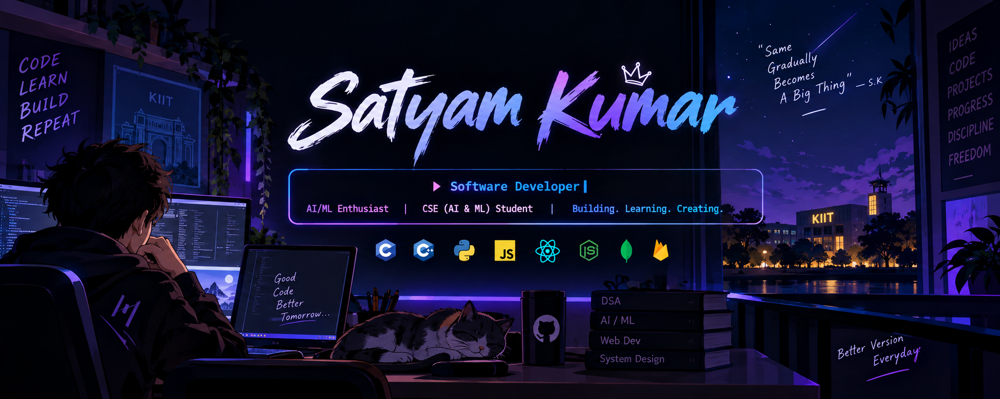

<!-- ==================== PROFILE BANNER ==================== -->

<!-- ==================== ANIMATED ROLE ==================== -->

### CSE (AI & ML) Student @ KIIT

Passionate about <b>Software Development</b>, <b>AI/ML</b>, <b>Web Development</b> and <b>DSA</b>.

---

# 🌐 Connect With Me

---

# 💻 Tech Stack

### 🔤 Languages

### 🌐 Web Development

### 🤖 AI / ML

### ☁️ Backend & Cloud

### 🎨 Design & Tools

---

# 📊 GitHub Stats

---

# 🐍 Contribution Activity

<picture>

<source
media="(prefers-color-scheme: dark)"
srcset="https://raw.githubusercontent.com/satyamkumar25923-gif/satyamkumar25923-gif/output/github-contribution-grid-snake-dark.svg"
/>

<source
media="(prefers-color-scheme: light)"
srcset="https://raw.githubusercontent.com/satyamkumar25923-gif/satyamkumar25923-gif/output/github-contribution-grid-snake.svg"
/>

</picture>

---

# 🚀 What I'm Currently Doing

---

# 📌 GitHub Profile

---

# 👀 Profile Views

  

### 💙 Thanks for visiting my profile!

**Let's build something awesome together.**

